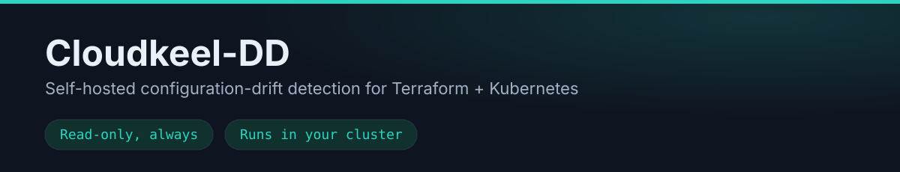

<p align="center">
  
</p>

<p align="center">
  <a href="https://github.com/cloudkeel/cloudkeel-dd/releases"></a>
  <a href="https://cloudkeel.io/docs"></a>
  
  
</p>

# Cloudkeel-DD

**Self-hosted configuration-drift detection for Terraform + Kubernetes teams.**
Cloudkeel-DD re-checks your Terraform-declared state against what's actually
running, on a schedule you set, and surfaces drift, unmanaged resources, and
policy violations — without ever taking custody of your cloud credentials.

> **This repo is a companion to the product, not its source.** Cloudkeel-DD is
> self-hosted commercial software: you run it in your own Kubernetes cluster,
> and your data never leaves it except through integrations you configure
> yourself. This repository exists for **release notes, documentation links,
> and support tickets** — the application source is not published here. See
> [LICENSE-NOTICE](#license--source) below.

---

## Quickstart

No account, no form, no pull secret — install straight from the public
registry:

```bash
# Needs Python 3 with the `cryptography` package (pip install cryptography).
FERNET=$(python3 -c "from cryptography.fernet import Fernet; print(Fernet.generate_key().decode())")
DATAKEY=$(python3 -c "from cryptography.fernet import Fernet; print(Fernet(b'$FERNET').encrypt(Fernet.generate_key()).decode())")
JWT=$(openssl rand -base64 48)

helm install dd oci://registry-1.docker.io/driftdetective/d-detective --version 0.3.7 \
  --namespace ddetective --create-namespace \
  --set secrets.fernetKey="$FERNET" \
  --set secrets.dataKeyWrapped="$DATAKEY" \
  --set secrets.jwtSecret="$JWT" \
  --set postgresql.auth.password="$(openssl rand -hex 16)"
```

<!-- MAINTAINERS: this must always match the version actually verified on the
     public OCI registry — check with
     `helm show chart oci://registry-1.docker.io/driftdetective/d-detective --version <v>`
     before bumping, never eyeball it. Keep in sync with TRY-CLOUDKEEL-DD.md
     and website/src/consts.ts (CHART_VERSION) in the private workspace. -->

Full walkthrough, prerequisites, and what to expect at each step: **[Try
Cloudkeel-DD →](https://cloudkeel.io/quickstart)**

Full documentation: **[cloudkeel.io/docs](https://cloudkeel.io/docs)** — also
mirrored in this repo under **[docs/](docs/)** for search visibility. The live
site updates first; every mirrored page links back to its own canonical
version.

Want to see every configurable option before you run the command above?
**[values.yaml](values.yaml)** in this repo is the exact default values file
from the published chart — pulled straight from the registry, not
hand-written, so it can't drift from what actually installs.

> **A note on two version numbers you may see elsewhere:**
> - **`0.3.0` installs but will not run.** Its chart is still published, but the
>   images it points at were removed from Docker Hub after `0.3.1` shipped, so
>   every pod hits `ImagePullBackOff`. This is permanent — use `0.3.2` or later.
> - **`0.3.3` was never published.** It exists in the chart's git history but
>   was skipped before release; `helm show chart --version 0.3.3` fails with no
>   such tag on the registry. There's no fix pending — just use `0.3.4` or
>   later.
>
> See [Releases](../../releases) for every version that's actually installable.

## What it checks today

- **Real-cloud drift-proven** (injected into a live account and detected
  field-level): **3 types** — Azure NSG rules, AWS security-group rules, GCP
  firewall rules.
- **Engine-verified** (passes golden-fixture tests, not yet proven on a live
  account): **200 spec'd types** — Azure 79, AWS 62, GCP 59.
- Everything else is inventory-level today.

Scans are **point-in-time**, not continuous. Full breakdown, methodology, and
what's honestly still a gap: **[Coverage →](https://cloudkeel.io/docs/coverage)**

## How it runs

- Entirely inside **your own cluster** — self-hosted, not a vendor-operated
  service. There is no Cloudkeel-DD-operated endpoint: no telemetry, no
  analytics, no licence server, no update check.
- **Read-only.** Detection never writes to your cloud. Remediation ships as a
  pull request you review and merge — nothing is auto-applied.
- Findings and credentials stay in **your own database**, encrypted with a key
  only your install holds. The only finding data that leaves is data *you*
  route out yourself — notification webhooks (Slack, Teams, Discord, generic)
  and GitHub/GitLab remediation PRs go to destinations you configure.
- Runs **unmetered for 30 days**, then converts to a **Free tier** — 1 enabled
  scope, 3 users, every feature, for as long as you want. Findings, history,
  integrations, and login all keep working; nothing is deleted. See
  **[Pricing →](https://cloudkeel.io/pricing)**.

## Pricing

One meter: pay per enabled scope (a subscription, account, project, or
cluster). No per-resource charges, ever.

| | Free | Team | Enterprise |
|---|---|---|---|
| **Price** | $0 forever | $79 / scope / mo¹ | from $20K/yr |
| **Scopes** | 1 | 2–20 | Custom |
| **Users** | 3 | 25 | Custom |
| **Features** | All | All | All |
| **Support** | Docs and community | Email, 2-business-day | Priority, named contact |

¹ Billed annually; $99/scope/mo month-to-month. Team also runs unmetered for
its first 30 days. Full breakdown and FAQ: **[cloudkeel.io/pricing →](https://cloudkeel.io/pricing)**

## Need a hand getting set up, not just software?

The **[Drift Audit](https://cloudkeel.io/audit)** is a fixed-price, 5-business-day
engagement where we help you install and configure Cloudkeel-DD against your
own accounts — a supervised install, never a vendor-operated audit; we do not
take custody of your credentials. It's a separate, paid offer from the
self-serve install above, which needs no call and no audit to run indefinitely.

## Support & issues

Found a bug, or something not working on your install? **[Open an
issue](../../issues/new/choose)** — see [SUPPORT.md](SUPPORT.md) first for what
to include (and please redact credentials/hostnames from anything you paste).

Found a **security vulnerability**? Do not open a public issue — see
[SECURITY.md](SECURITY.md).

## License & source

This repository contains documentation, release notes, and issue tracking
only — no application source. Cloudkeel-DD is proprietary software licensed
for self-hosted use under the terms accepted at install; see
[cloudkeel.io/terms](https://cloudkeel.io/terms). All content in this
repository is © Cloudkeel Systems unless stated otherwise.
